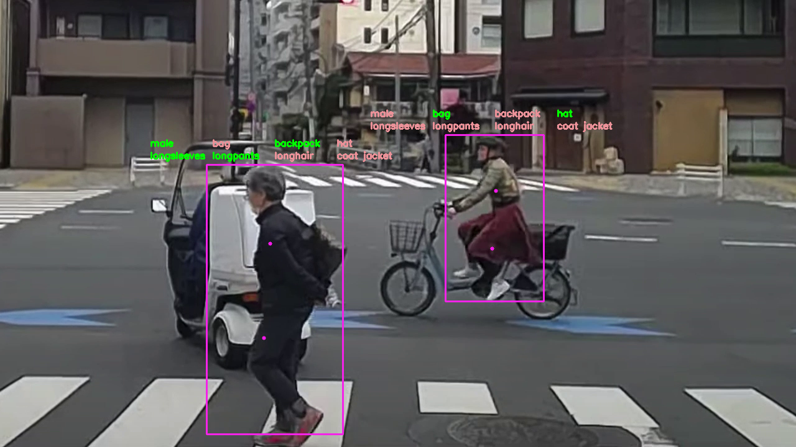

# person-attributes-recognition
- OpenVINOを用いて、動画内に描画されている人がどのようなものを身に着けているかを判別するプログラムです
- 身に着けてるものは緑で表示され、身に着けてないもの赤で表示されます
- 人物は矩形で囲われ、上半身と下半身にそれぞれ点が打たれます

### デモの切り取り

### 環境
- python3.8
- numpy 1.18.5
- OpenVINO
- OpenCV2
